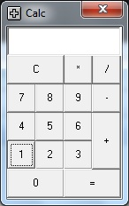

# Simplest-Calculator-VB6-oldSchool

The simplest calculator ever, only show results as long numbers without comma separated values, division only return a integer value.

Project created only for educational purposes

## Screenshot

